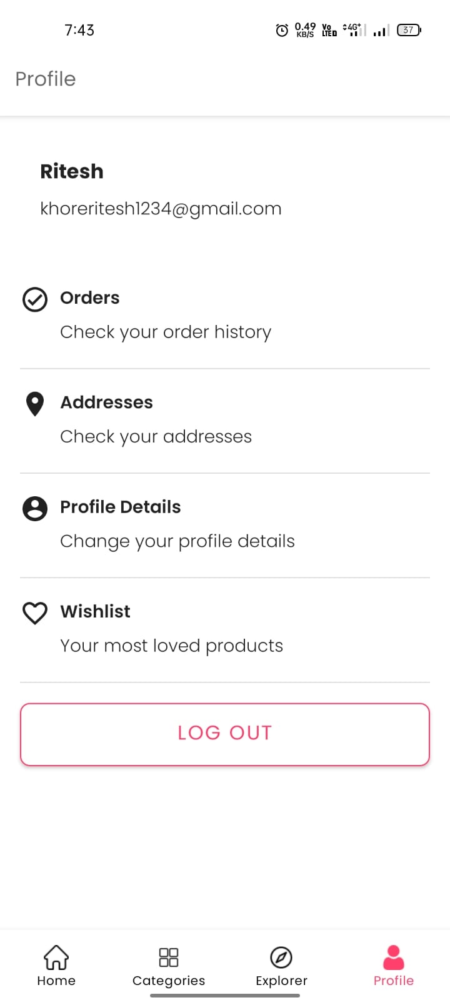

# Myntra Clone

Myntra is popular fashion brand website. It is a ecommerce website where you can buy clothes, shoes, and accessories.
Here is my Myntra Clone which is a clone of Myntra App.

## Features

    1. Register and login functionality
    2. OTP verification of email
    3. Profile page in which you can edit your profile
    4. Orders history where you can find your previous orders
    5. Cart page where you can see the items added to the cart
    6. You can get the products by categories
    7. Address page where you can add your address
    8. Payment page where you can choose payment method and do the payment

## Additional Features

    1. Server side caching by using Redis
    2. Model View Control (MVC) Architecture for backend application
    3. Model View View Model (MVVM) with clean architecture for android    frontend application.
    4. Dependancy Injection for the android frontend application
    5. Typescript for the backend as well as web frontend application
    6. Offline data caching in android frontend using Room Database
    7. Instead of using regular XML using Jetpack Compose for application building
    8. Razorpay payment verification using the webhooks of razorpay
    9. Pagination support
    10. Admin pannel for controlling the application

## Tech Stack

**Web Frontend** - ReactJS, Typescript, Styled Components, Redux, Axios

**Backend** - NodeJS, Express, Prisma JS, Planet Scale, Typescript, Passport JS, JWT, Cloudinary, Redis Client, SendGrid

**App Frontend** - Kotlin, Jetpack Compose, Materia IO, Room Database, RazorPay

## Screen Shots

#### Android Application

#### Admin Dashboard

